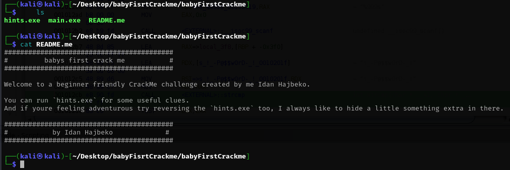
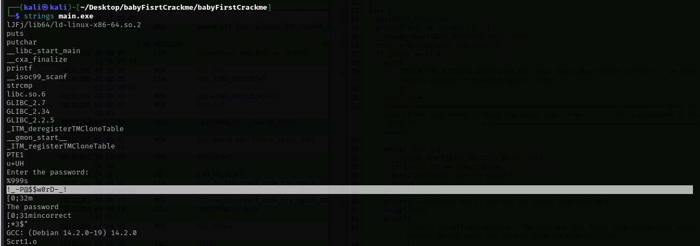
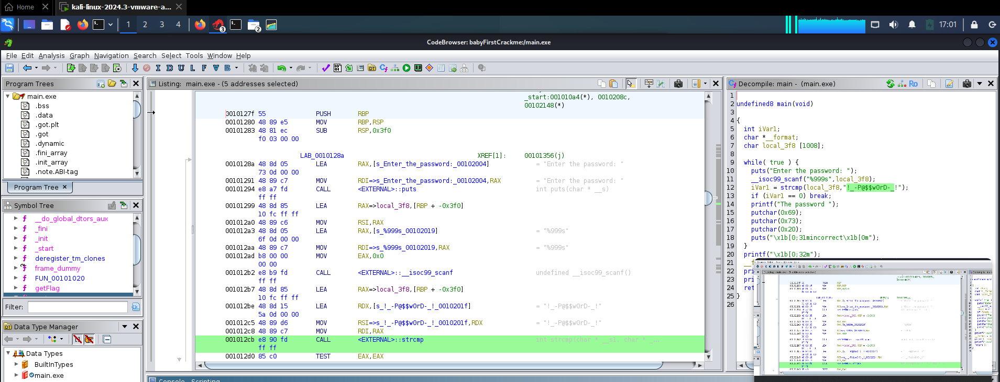
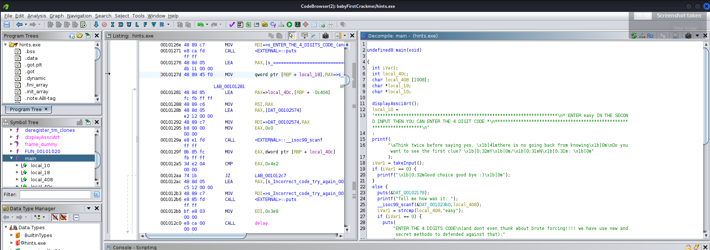
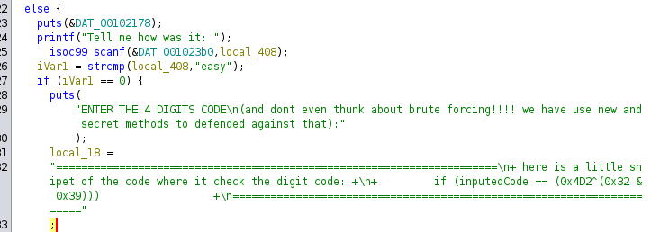
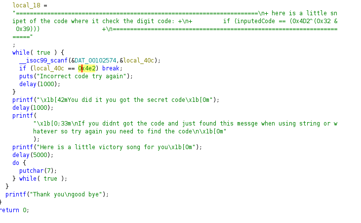

# 🔓 Reverse Engineering Writeup: idanhajbeko's babyFirstCrackme

##  Objective

Reverse engineer the provided binaries `babyFirstCrackme` and `hint.exe` to uncover the correct password and secret code logic, and understand how they are validated.
(https://www.crackmes.one/crackme/680d04208f555589f3530fb5)
### Challenge Content


---


## 🛠 Tools Used

- `strings` (to extract human-readable text)
- Ghidra (for static analysis and decompilation)

---

##  Step 1: Recon with `strings`

Running `strings` on `babyFirstCrackme` revealed a suspicious password-like string:
```bash
strings  main.exe
```


```text
!_-P@$$w0rD-_!
```

This strongly hinted the password is hardcoded.

---

## 🔍 Step 2: Static Analysis of `babyFirstCrackme` in Ghidra

### 📌 Main Function Breakdown



#### ➤ Prompt for Password

```c
puts("Enter the password: ");
```

#### ➤ Read Input

```c
__isoc99_scanf("%999s", local_3f8);
```

* Input is read into a buffer `local_3f8` with ample space (1008 bytes).

#### ➤ Password Comparison

```c
iVar1 = strcmp(local_3f8, "!_-P@$$w0rD-_!");
```

* User input is directly compared to the hardcoded string `!_-P@$$w0rD-_!`.

#### ➤ Incorrect Password Behavior

```c
if (iVar1 != 0) {
    printf("The password ");
    putchar('i');
    putchar('s');
    putchar(' ');
    puts("incorrect");
}
```

* If the password doesn't match, a message indicating it's incorrect is printed.

#### ➤ Correct Password Behavior

```c
puts("Enter the password: ");
__isoc99_scanf("%999s", local_3f8);
iVar1 = strcmp(local_3f8, "!_-P@$$w0rD-_!");
```

- The binary directly compares user input to the hardcoded string.
- If matched, it prints the flag using `getFlag()` with terminal formatting.

✅ **Conclusion**: The password is `!_-P@$$w0rD-_!`.

---

## 🔍 Step 3: Analyzing `hint.exe` in Ghidra

This program gives a secondary challenge, offering a "clue path" once a correct keyword is given.



### 🧾 User Interaction Logic

- Displays ASCII art (`displayAssciArt()`).
- Prompts the user:

```text
Think twice before saying yes, there is no going back from knowing
Do you want to see the first clue? Y/N:
```

- If user says no (`takeInput()` returns 0):  
  → It prints: `"Good choice good bye :)"`

- If user says yes:
  - It prints a long warning with a clue:

    ```text
    **********************************************************************
    * ENTER easy IN THE SECON D INPUT THEN YOU CAN ENTER THE 4 DIGIT CODE *
    *************************************************** *******************
    ```

---

### 📌 Second Input Check


```c
scanf(..., local_408);
strcmp(local_408, "easy");
```

- If input is `"easy"`, the program reveals a second prompt and a hidden code verification system.

---

### 🔐 Code Check Logic


The message says:


```text
ENTER THE 4 DIGITS CODE
(and don't even think about brute forcing!!!! we have use new and secret methods to defended against that):
```

Then the following code check is shown:

```c
if (inputedCode == (0x4D2 ^ (0x32 & 0x39)))
```

Let's evaluate that:

- `0x4D2` = 1234 (decimal)
- `0x32 & 0x39` = 0x30 (48 decimal)
- So, `1234 ^ 48 = 0x4E2` → `inputedCode == 0x4E2` → `inputedCode == 1250`

✅ **Correct Code**: `1250`

---

### 🎉 Success Path

If the user inputs the correct code:

```c
printf("You did it you got the secret code");
```

- A success message is printed
- A sound loop is triggered via `putchar(7);`

---

## 🧾 Summary

- `babyFirstCrackme` required a hardcoded password: `!_-P@$$w0rD-_!`
- `hint.exe` involved:
  1. Choosing to reveal a clue
  2. Typing `"easy"` to unlock next stage
  3. Entering the derived 4-digit code: `1250`

---